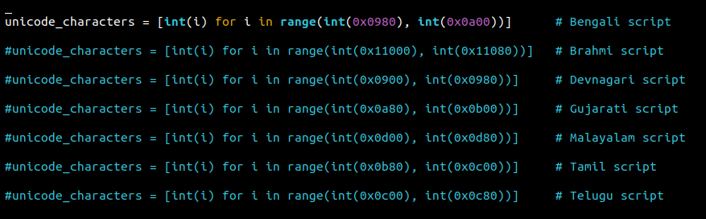

# unicode_language_scripts

This is a simple program for the printing the characters and the Unicode code points of various language scripts.

I have referred to various Unicode scripts for the range of various languages scripts.

The different scripts have been commented. To print the respective script simply the uncomment that one and comment the rest.

# Hexadecimal range of various scripts:

| Script              |        Range                        |     Unicode PDF Link                                 |
| -----------------   | ----------------------------------  |  --------------------------------------------------  |
|  Bengali             |     0x0980 - 09FF                   | https://unicode.org/charts/PDF/U0980.pdf             |  
|  Brahmi              |     0x11000 - 0x1107F               | https://unicode.org/charts/PDF/U11000.pdf            |
|  Devanagari          |     0x0900 - 0x097F                 | https://unicode.org/charts/PDF/U0900.pdf             |
|  Gujarati            |     0x0A80 - 0x0AFF                 | https://unicode.org/charts/PDF/U0A80.pdf             |
|  Malayalam           |     0x0D00 - 0x0D7F                 | https://www.unicode.org/charts/PDF/U0D00.pdf         |
|  Tamil               |     0x0B80 - 0x0BFF                 | https://unicode.org/charts/PDF/U0B80.pdf             |
|  Telugu              |     0x0C00 - 0x0C7F                 | https://www.unicode.org/charts/PDF/U0C00.pdf         |
