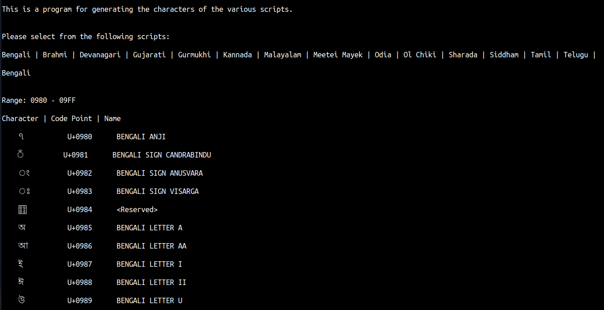
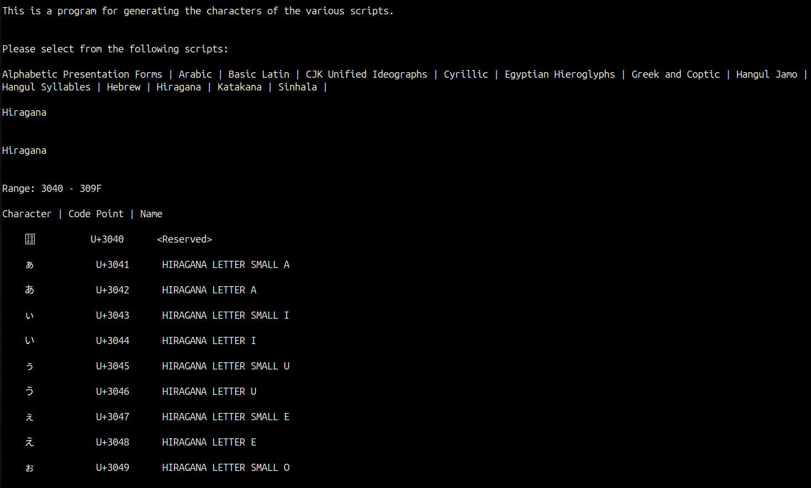

# language_scripts

This is a simple program for printing the characters and the Unicode® code points of various language scripts in addition to their character names.

I have referred to the Unicode® Standard to print the characters of the various language scripts.

You will be asked to select the script for which characters will be displayed from the given options.

If you enter an invalid script, i.e. not in the given options list, it will generate an 'Invalid input' message. After 3 incorrect inputs the program will terminate.

## Note: 

For the characters to appear on your system, you might require to install fonts for the respective scripts. 
For example for the Brahmi script, you need this font on your system:

https://fonts.google.com/noto/specimen/Noto+Sans+Brahmi

For Ol Chiki:

https://fonts.google.com/noto/specimen/Noto+Sans+Ol+Chiki
      
## Sample output of the program:

The `<Reserved>` is printed when a hexadecimal value has not been alloted any character. Refer to Unicode table for more information.

## More scripts:

## Hexadecimal range of various scripts:

| Script              |        Range                        |                      PDF Link                        |
| -----------------   | ----------------------------------  |  --------------------------------------------------  |
|  Bengali            |     0x0980 - 0x09FF                 | https://unicode.org/charts/PDF/U0980.pdf             |  
|  Brahmi             |     0x11000 - 0x1107F               | https://unicode.org/charts/PDF/U11000.pdf            |
|  Devanagari         |     0x0900 - 0x097F                 | https://unicode.org/charts/PDF/U0900.pdf             |
|  Gujarati           |     0x0A80 - 0x0AFF                 | https://unicode.org/charts/PDF/U0A80.pdf             |
|  Gurmukhi           |     0x0A00 - 0x0A7F                 | https://unicode.org/charts/PDF/U0A00.pdf             |
|  Kannada            |     0x0C80 - 0x0CFF                 | https://unicode.org/charts/PDF/U0C80.pdf             |
|  Malayalam          |     0x0D00 - 0x0D7F                 | https://www.unicode.org/charts/PDF/U0D00.pdf         |
|  Meetei Mayek       |     0xABC0 - 0xABFF                 | https://unicode.org/charts/PDF/UABC0.pdf             |
|  Odia               |     0x0B00 - 0x0B7F                 | https://unicode.org/charts/PDF/U0B00.pdf             |
|  Ol Chiki           |     0x1C50 - 0x1C7F                 | https://www.unicode.org/charts/PDF/U1C50.pdf         |
|  Sharada            |     0x11180 - 0x111DF               | https://unicode.org/charts/PDF/U11180.pdf            |
|  Siddham            |     0x11580 - 0x115FF               | https://www.unicode.org/charts/PDF/U11580.pdf        |                              
|  Takri              |     0x11680 - 0x116CF               | https://www.unicode.org/charts/PDF/U11680.pdf        |
|  Tamil              |     0x0B80 - 0x0BFF                 | https://unicode.org/charts/PDF/U0B80.pdf             |
|  Telugu             |     0x0C00 - 0x0C7F                 | https://www.unicode.org/charts/PDF/U0C00.pdf         |

## More scripts:

| Script                              |        Range                        |                      PDF Link                        |
| ------------------------------------| ----------------------------------  |  --------------------------------------------------  |
| Alphabetic Presentation Forms       |    0xFB00 – 0xFB4F                  | https://www.unicode.org/charts/PDF/UFB00.pdf         |
| Arabic                              |    0x0600 - 0x06FF                  | https://www.unicode.org/charts/PDF/U0600.pdf         |
| Basic Latin                         |    0x0000 - 0x007F                  | https://unicode.org/charts/PDF/U0000.pdf             |
| Cyrillic                            |    0x0400 - 0x04FF                  | https://www.unicode.org/charts/PDF/U0400.pdf         |
| CJK Unified Ideographs              |    0x4E00 - 0x9FFF                  | https://www.unicode.org/charts/PDF/U4E00.pdf         |
| Egyptian Hieroglyphs                |    0x13000 - 0x1342F                | https://www.unicode.org/charts/PDF/U13000.pdf        |
| Greek and Coptic                    |    0x0370 - 0x03FF                  | https://unicode.org/charts/PDF/U0370.pdf             |
| Hangol Jamo                         |    0x1100 - 0x11FF                  | https://www.unicode.org/charts/PDF/U1100.pdf         |
| Hangol Syllables                    |    0xAC00 - 0xD7AF                  | https://unicode.org/charts/PDF/UAC00.pdf             |
| Hebrew                              |    0x0590 - 0x05FF                  | https://www.unicode.org/charts/PDF/U0590.pdf         |
| Hiragana                            |    0x3040 - 0x309F                  | https://www.unicode.org/charts/PDF/U3040.pdf         |
| Katakana                            |    0x30A0 - 0x30FF                  | https://www.unicode.org/charts/PDF/U30A0.pdf         |
| Sinhala                             |    0x0D80 - 0x0DFF                  | https://www.unicode.org/charts/PDF/U0D80.pdf         |
